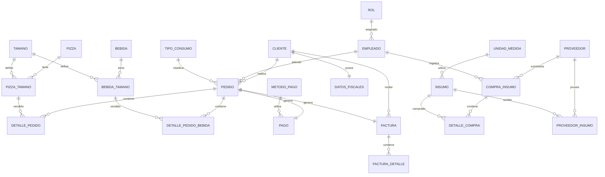

# Base de Datos Pizzería

## Diagrama Entidad Relación

# Proyecto de Normalización de Base de Datos

## Primera Forma Normal (1FN)

En esta etapa se identificaron las entidades principales de la pizzería y sus atributos.

### Entidades identificadas

- Cliente
- Empleado
- Pizza
- Pedido
- Proveedor
- Insumo

---

## Segunda Forma Normal (2FN)

Se eliminaron dependencias parciales y se separaron las entidades relacionadas.

### Nuevas entidades

- Rol
- Tipo Consumo
- Unidad Medida
- Proveedor-Insumo
- Compra-Insumo
- Detalle Compra
- Pizza-Tamaño
- Detalle Pedido
- Método Pago
- Pago

---

## Tercera Forma Normal (3FN)

Se eliminaron dependencias transitivas y se agregaron nuevas entidades para mejorar la integridad de los datos.

### Nuevas entidades

- Bebida
- Tipo Bebida
- Bebida Tamaño
- Datos Fiscales
- Factura
- Factura Detalle
- Detalle Bebida
- Cancelación Pedido
- Cancelación Factura

---

## Tablas de Cancelación

