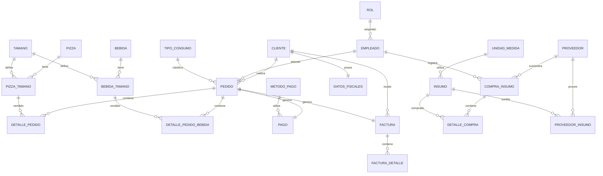

# Base de Datos Pizzería

## Diagrama Entidad Relación

```mermaid
erDiagram

    CLIENTE ||--o{ PEDIDO : realiza
    EMPLEADO ||--o{ PEDIDO : atiende
    TIPO_CONSUMO ||--o{ PEDIDO : clasifica

    PEDIDO ||--o{ DETALLE_PEDIDO : contiene
    PEDIDO ||--o{ DETALLE_PEDIDO_BEBIDA : contiene

    PIZZA ||--o{ PIZZA_TAMANO : tiene
    TAMANO ||--o{ PIZZA_TAMANO : define

    BEBIDA ||--o{ BEBIDA_TAMANO : tiene
    TAMANO ||--o{ BEBIDA_TAMANO : define

    PIZZA_TAMANO ||--o{ DETALLE_PEDIDO : vendido
    BEBIDA_TAMANO ||--o{ DETALLE_PEDIDO_BEBIDA : vendido

    PEDIDO ||--|| PAGO : genera
    METODO_PAGO ||--o{ PAGO : utiliza

    CLIENTE ||--o{ FACTURA : recibe
    PEDIDO ||--|| FACTURA : genera
    FACTURA ||--o{ FACTURA_DETALLE : contiene

    CLIENTE ||--|| DATOS_FISCALES : posee

    PROVEEDOR ||--o{ COMPRA_INSUMO : suministra
    EMPLEADO ||--o{ COMPRA_INSUMO : registra

    COMPRA_INSUMO ||--o{ DETALLE_COMPRA : contiene
    INSUMO ||--o{ DETALLE_COMPRA : comprado

    UNIDAD_MEDIDA ||--o{ INSUMO : utiliza

    PROVEEDOR ||--o{ PROVEEDOR_INSUMO : provee
    INSUMO ||--o{ PROVEEDOR_INSUMO : surtido

    ROL ||--o{ EMPLEADO : asignado
```